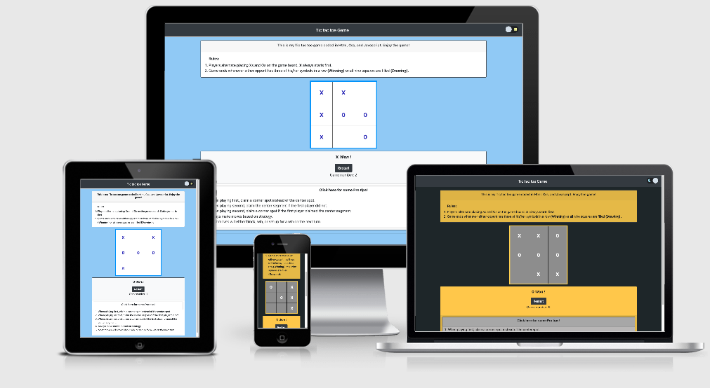
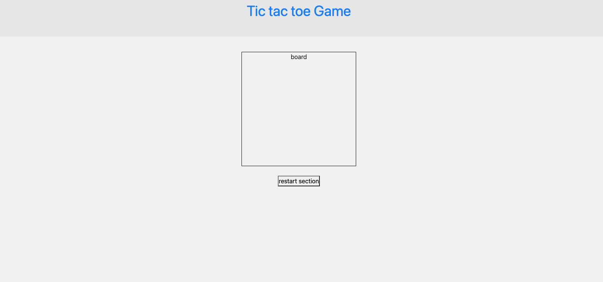
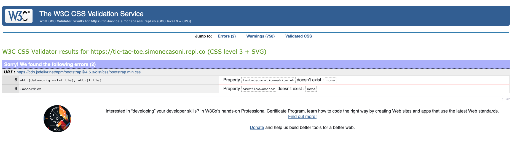
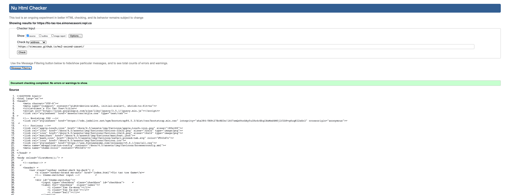
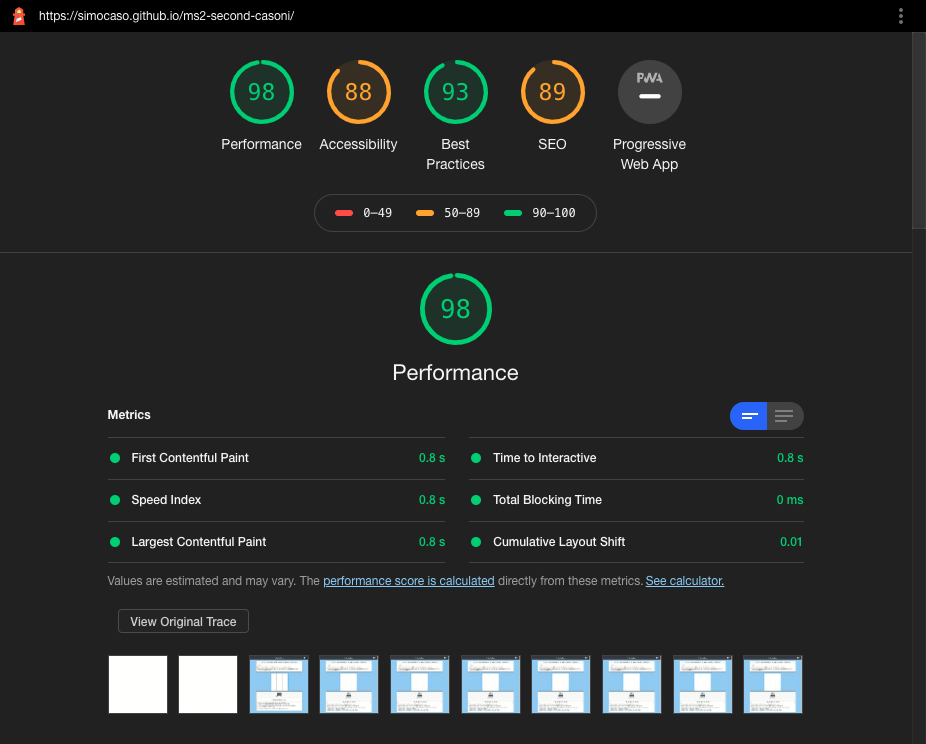

  

# Simon's Tic Tac Toe

Simone Casoni's Second Milestone project:

[View the live project here.](https://simocaso.github.io/ms2-second-casoni/)

# Introduction

## UX

### Design
I wanted to create a clean website where users could directly undestrand its purpose. In order to accomplish that, the home page shows you a carousel comprehensive of our 3 main purposes: "WHO AND WHERE", "OUR BIKES", and "REVIEWS".  

### Colour Scheme

- The main colours used are black, grey, white (monochromatic) and yellow. To give the website a clean, serious, and professional.

### Typography

- Lato e Osvald, in order to give you a young and dinamic impression.

### Imagery

- Imagery is important. The large, background image is designed to let you feel involved!

### Wireframes

- Wireframe - created a preview using html and css

  
  
## User stories:

### Users:
-   As a user, I'd like to visit a clean and clear website.
-   As a user, I'd like to be able to see the different range and type of bikes.
-   As a user, I'd like to see the location of the business.
-   As a user, I'd like to see reviews by other customers.
-   As a user, I'd like to see the different types of services that the business offers, including full pricing details.
-   As a user, I'd like to be able to click the contact number and email to contact the business straight away if I so wish.

### Astra rental business owner:
- As a business owner, I'd like to let my users have a clear idea of what we are and who we are
- As a business owner, I'd like to clearly show our bikes fleet and prices 
- As a business owner, I'd like to share a bit of who we are and what we want to offer
- As a business owner, I'd like to have a website that looks fresh and professional at the same time

## Features

- Responsive on all device sizes
- Moving carousel, to show immediately every content 
- Interactive bottons in the carousel (if you leave your cursor above them, they will stop the sliding. They also redirect you to the respective section)
- Navbar menu, with the resspective sections redirects
- Scrollspy function to help you visualizing where you are
- When you pass above the bikes cards, they will expand a bit, to help you focusing on them
- Google maps interactive window 

## Technologies Used

### Languages Used

- [HTML5](https://en.wikipedia.org/wiki/HTML5)

- [CSS3](https://en.wikipedia.org/wiki/Cascading_Style_Sheets)

  

### Frameworks, Libraries & Programs Used

1. [Repl:](https://repl.it/)

- fast and useful editor!.

2. [Bootstrap 4.4.1:](https://getbootstrap.com/docs/4.4/getting-started/introduction/)

- Bootstrap was used to assist with the responsiveness and styling of the website.

3. [jQuery:](https://jquery.com/)

- jQuery came with Bootstrap to make the navbar responsive but was also used for the smooth scroll function in JavaScript.

4. [Hover.css:](https://ianlunn.github.io/Hover/)

- Hover.css was used on the Social Media icons in the footer to add the float transition while being hovered over.

5. [Font Awesome:](https://fontawesome.com/)

- Font Awesome was used on all pages throughout the website to add icons for aesthetic and UX purposes.

6. [Git/Gitpod:](https://git-scm.com/)

- Git was used for version control by utilizing the Gitpod terminal to commit to Git and Push to GitHub.

7. [GitHub:](https://github.com/)

- GitHub is used to store the projects code after being pushed from Git.

8.  [https://tinypng.com/](https://tinypng.com/)
- for letting me save almost 61% of spaces occupied by images and speeding up the website loading
  
 ## Deployment

This website has been deployed to GitHub Pages as  [ms1.2-astra-rental](https://simocaso.github.io/ms1.2-astra-rental/)

The process for deployment is documented below:

-   Log into  [GitHub](https://www.github.com/)
    
-   Access the page with the repository for this project
    
-   Click on 'Settings' on the main menu over the file listing
    
-   Navigate down to 'GitHub Pages'
    
-   Select 'Branch: Master' from the menu
    
-   This generates a live link for the website, which is now viewable publicly
-  
## Testing

The W3C Markup Validator and W3C CSS Validator Services were used to validate every page of the project to ensure there were no syntax errors in the project.

- [W3C CSS Validator](https://jigsaw.w3.org/css-validator/#validate_by_input) - passed - No errors

  

- [W3C Markup Validator](https://jigsaw.w3.org/css-validator/#validate_by_input) : 7 errors shown (but only for the code copied from Embedgooglemap, used for the google maps content)

  

### Further Testing

- The Website was tested on Google Chrome, Internet Explorer, and Safari browsers.

- The website was viewed on a variety of devices such as Laptop (Apple Macbook pro, Chromebook), iPhone devices ( iPad 10 pro, iPhone 11 pro, iPhone 7, iPhone X, iPhone 8), Android devices (Samsung galaxy s5, Samsung A7, Huawei P20), and Desktop (with 22", 24", 17" monitors).

- A large amount of testing was done to ensure that all pages were linking correctly.

- Friends and family members were asked to review the site and documentation to point out any bugs and/or user experience issues.

- I used Light house, an open-source automated tool, to test the performance of the website. The site performed a good average score of 92:

  

 
### Known Bugs

No bugs found/left over so far

### Fixed bugs, respective solutions

- navbar bottom could have been confused with the background 
  -> added a small border on the bottom
  
- navbar animations don't follow you whenever you scroll the page
  -> added a scrollspy component
  
- section's tops are a bit cropped when you click on the navbar's links
  -> added some padding on the top
  
- couldn't add a backgroung image to carousel's slides
  -> rebuilt the carousel manually and fixed the img paths

- couldn't center the google maps location
  -> fixed it through bootstrap column method and by adjusting the inner div responsiveness 

## Credits

### Code

- Took very very few things (navbar base, footer base, and some actual contents) from my previous website code on Repl,  https://repl.it/@simonecasoni/motocross-rental-bike
- [Bootstrap4](https://getbootstrap.com/docs/4.4/getting-started/introduction/): Bootstrap Library used throughout the project mainly to make site responsive using the Bootstrap Grid System.
- [Embedgooglemap](https://www.embedgooglemap.net/en/) for the google maps box code

### Media

-  [Font Awesome](https://fontawesome.com/6?next=%2Fstart)  for the icons used on this project.
-  [Am I Responsive](http://ami.responsivedesign.is/)  for the image used in the UX section showing the different screen sizes.
-  [Favicon](https://www.favicon.io/)  for the thumbnail icon on the internet tab header
- [https://tinypng.com/](https://tinypng.com/) for letting me show how much spaced i saved
- [Google](https://www.google.com/), for all the images i've found
 
### Acknowledgements and Thanks

I would like to mention all the different resources and sites that are out there, with their respective communities, which have been a huge help for me. I will list some of them below:
- Repl
-   Bootstrap
-   Git Hub and Git Pod
-   Font Awesome
-   jQuery developers
-   Stack Overflow
-   Slack
- coffee (!important)
And lastly, I could not leave out the Code Institute team: Alex who has been so comprehensive and kind, my mentor Felipe Souza Alarcon for his help and advices during this project, his flexibility and availability.
## Game logic and functions

#### Logic
- The game is played on a 3x3 game board
- One player will use the "X" symbol,and the other one will use the "O" symbol 
- Players alternate placing Xs and Os on the game board
- Game ends whenever either oppent has three of his/her symbols in a row (winning) or all nine squares are filled.
- The possible results are: "X won the game!", "O won the game!", "It's a draw!"

#### Functions
- a function will have to let the game messages' box say who has to start whenever the page loads/refreshes
- a function will let the player choose his/her symbol
- a function will let the players insert a symbol (either "X" or "O") in the cells
- a function will have to swtich the player whenever one of them has made his/her move
- a function will check if a player has put 3 of his/her symbols in a row (vertically, horizontally, diagonally)
- if a player makes a "tris", a function will need to announce the winner, else - it'll show "it's a draw"
- if a player wins with less than 9 cells filled up, a function won't make any other move available  
- associated with a "refresh" button, a function will clear the board

#### Eventual bugs
1. Only the first player is able to insert his/her symbol -> Add function switchPlayer() to change symbol each turn
2. when clicking on a symbol, it changes each time instead of being freezed ->
3. For a fraction of second, it was showing "message shown", in the game-msg box, while loading the page -> removed game-msg text  
4. game was showing "(symbol) won!" even though the game isn't finished
5. Couldn't display who won the game -> added "== move &&" to verifyTris function to let the cells be checked property
6. If the player tied, no "it's a tie" message is shown.
7. Button restart should clear the board and not refresh the page

#### next features
1. Adding the possibility to add symbols though keyboards numbers

HAD TO PUSH AN EMPTY COMMIT: git commit --allow-empty -m "trigger rebuilt" , main page (https://simocaso.github.io/ms2-second-casoni/) was showing error 404

