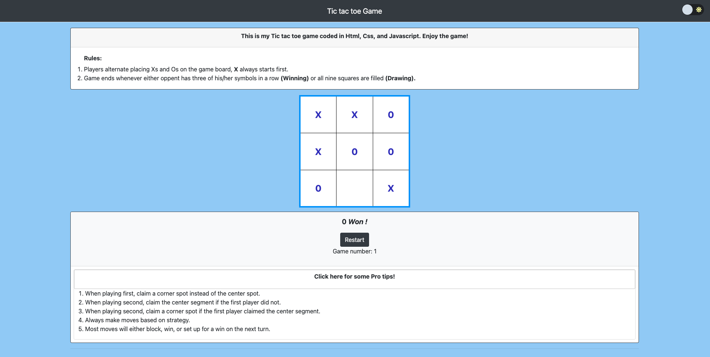
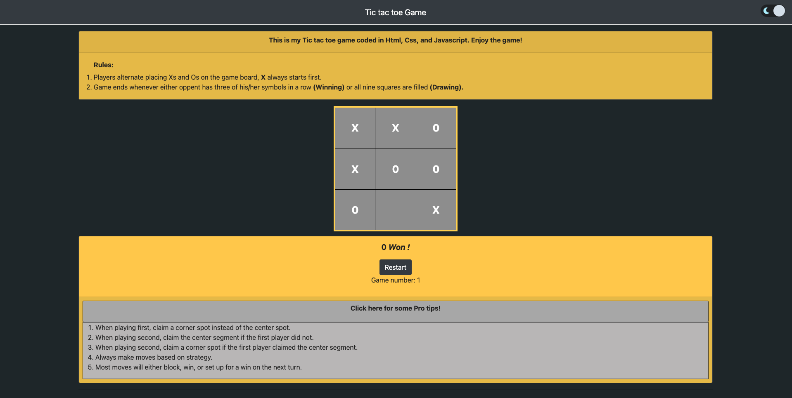
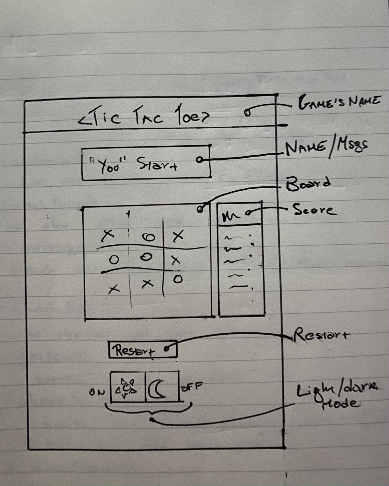
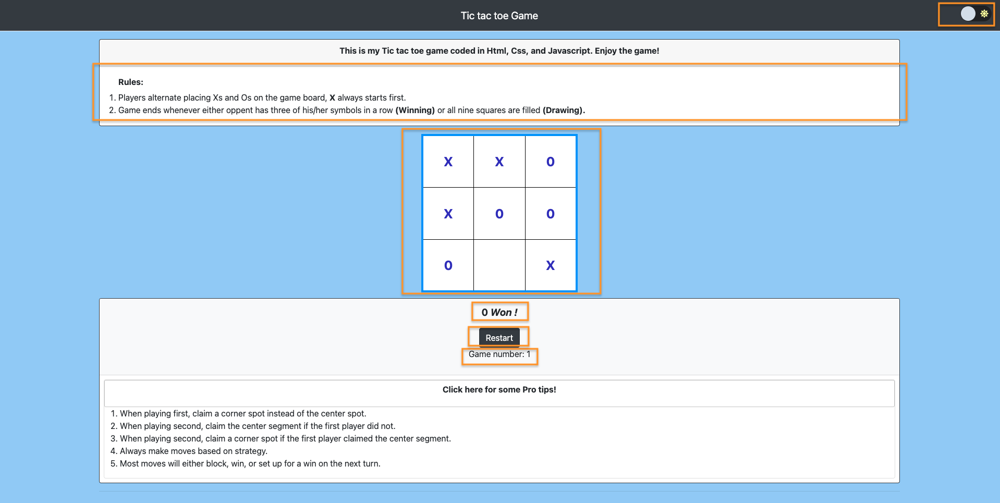
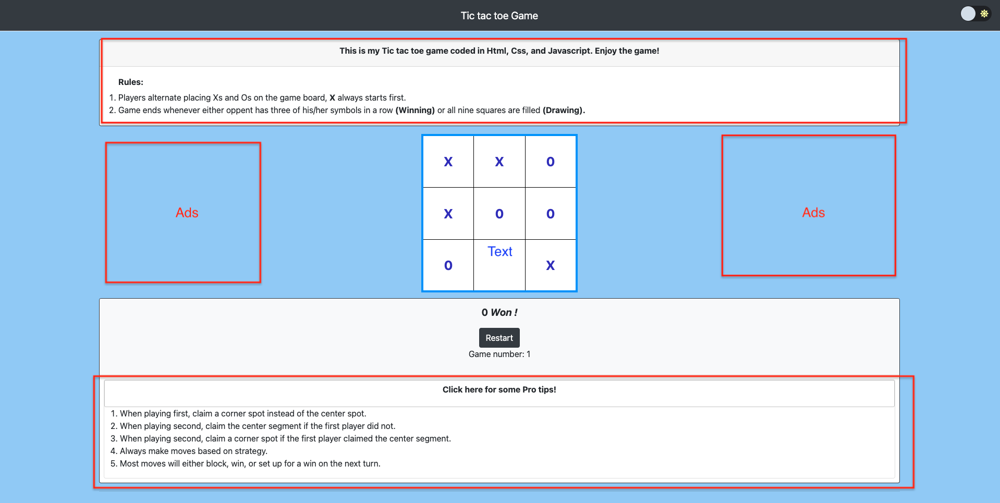
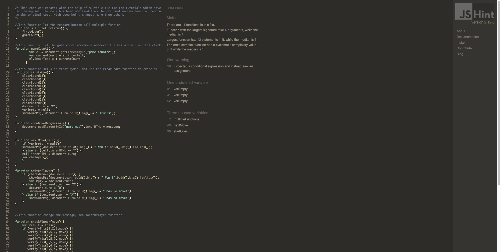

# Simon's Tic Tac Toe

## Simone Casoni's Second Milestone project :

[LIVE DEPLOYMENT OF WEBSITE](https://simocaso.github.io/ms2-second-casoni/)

 
# Introduction
Simon's Tic tac toe is a well known interactive game based on two symbols: "X" and "O", whereas two players can play with each other to have some fun and build some strategy skills.
Players can also click on the "Pro tips" box so they can have a look at some insights in order to win the game, or at least not lose!
Moreover, especially for those who like to play in the night, the game presents a night-mode design actionable via an intuitive toggle!

I have to say that I spent quite a lot of time, before starting programming, only to think, study, and prepare all the functions present in the code. I will add them to the development section.

---

## UX

### Design 
I wanted to create a clean website where users could directly understand its purpose. In order to accomplish that, the home page directly shows you the Tic tac toe board, the dark-mode toggle, and the Pro tips box.  

### Colour Scheme

#### Light mode

- The main colours used for the *Light-mode* are white and light blue, to give the website a clean and friendly look.

#### Dark mode

- The main colours used for the *Dark-mode* are grey and yellow, to give the website a dynamic and eye-friendly look.

### Typography

- "SF Pro Display", "SF Pro Icons", "Helvetica Neue", "Helvetica", "Arial", and "sans-serif" have been put in the css in order to always give you a young and dinamic impression.

### Imagery

- This time I have chosen to insert no image, so I could have let myself focusing on the game logic.

### Wireframes

Wireframe - created 2 previews, one using html and css, and the other one with pen and paper.

---
## User stories:

### Users:
-   As a user, I'd like to visit a clean and clear website.
-   As a user, I'd like to be able to switch between light and dark mode.
-   As a user, I'd like to see how many times I've played with my friends.
-   As a user, I'd like to have feedback regarding my moves.
-   As a user, I'd like to see the game instructions.

### Website owner:
- As a business owner, I'd like to let my users have a clear idea of what the website is offering.
- As a business owner, I'd like to give my users the possibility of using the dark mode.
- As a business owner, I'd like to have some empty space on the page so I could place some ads.
- As a business owner, I'd like to show my users some pro tips so they could improve their skills.

## Features

- Responsive to all device sizes and browsers
- Tic Tac Toe Interactive game
- Dark/light mode toggle on the right-top corner
- Pro tips expandable box
- A game counter that increments every time a player restarts the game
- Prompt feedback message box
- A restart button to clear the board
---

## Technologies Used

### Languages Used

- [HTML5](https://en.wikipedia.org/wiki/HTML5)

- [CSS3](https://en.wikipedia.org/wiki/Cascading_Style_Sheets)

- [JAVASCRIPT](https://en.wikipedia.org/wiki/JavaScript)

### Frameworks, Libraries & Programs Used

1. [Repl](https://repl.it/)

2. [Bootstrap 4.5.3](https://getbootstrap.com/docs/4.4/getting-started/introduction/)

3. [jQuery](https://jquery.com/)

4. [Font Awesome](https://fontawesome.com/)

5. [Git/Gitpod](https://git-scm.com/)

6. [GitHub](https://github.com/)

7. [heictojpg.com](https://heictojpg.com/)

### External Resources

1. [JSHint](https://jshint.com/) - Used to test/validate JavaScript Code.

2. [W3C HTML Validator](https://validator.w3.org/) - Used to test/validate HTML code on the website.

3. [W3C CSS Validator](https://jigsaw.w3.org/css-validator/) - Used to test/validate the CSS code on the website.

4. [W3 Schools](https://www.w3schools.com/) - Used as a general resource to help with coding.

5. [Am I Responsive](http://ami.responsivedesign.is/) - Used to create mockup of responsive website for *README.md*. 

6. [Youtube](https://www.youtube.com/) - Used as a general resource for help with code.

7. [Lighthouse](https://developers.google.com/web/tools/lighthouse) - Used to check accessabilty and SEO scores for the website.

8. [Code Institute](https://codeinstitute.net/) - Main source of coding knowledge.

9. [Code institute Slack Community](https://app.slack.com/) - Used for js insights.
--- 
 ## Deployment

This website has been deployed to GitHub Pages as  [ms2-second-casoni](https://github.com/Simocaso/ms2-second-casoni)

The process for deployment is documented below:

-   Log into  [GitHub](https://www.github.com/)
    
-   Access the page with the repository for this project
    
-   Click on 'Settings' on the main menu over the file listing
    
-   Navigate down to 'GitHub Pages'
    
-   Select 'Branch: Master' from the menu
    
-   This generates a live link for the website, which is now viewable publicly

-   Moreover, I had to push an empty commit: " **git commit --allow-empty -m "trigger rebuilt** " as (https://simocaso.github.io/ms2-second-casoni/) was showing error 404
 
---
## Testing

The W3C Markup Validator and W3C CSS Validator Services were used to validate every page of the project to ensure there were no syntax errors in the project.

- [W3C CSS Validator](https://jigsaw.w3.org/css-validator/#validate_by_input) - No errors found in my personal CSS code

  

- [W3C Markup Validator](https://jigsaw.w3.org/css-validator/#validate_by_input) - passed - No errors found so far

  

- [JSHint](https://jshint.com/) - no big issues found so far

  

 

## Further Testing 

- The Website was tested on Google Chrome, Firefox, and Safari browsers.

- The website was viewed on a variety of devices such as Laptop (Apple Macbook pro, Chromebook), iPhone devices ( iPad 10 pro, iPhone 11 pro, iPhone 7, iPhone X, iPhone 8), Android devices (Samsung galaxy s5, Samsung A7, Huawei P20), and Desktop (with 22", 24", 17" monitors).

- A large amount of testing was done to ensure that all pages were linking correctly.

- Friends and family members were asked to review the site and documentation to point out any bugs and/or user experience issues.

- I used Light house, an open-source automated tool, to test the performance of the website. The site performed a good average score of 92:

  

 
### Development 

---

#### Game logic
- The game is played on a 3x3 game board
- One player will use the "X" symbol, and the other one will use the "O" symbol 
- Players alternate placing Xs and Os on the game board
- Game ends whenever either opponent has three of his/her symbols in a row (winning) or all nine squares are filled.

#### Functions
- a function will have to let the game messages' box say who has to start whenever the page loads/refreshes
- a function will let the player choose his/her symbol
- a function will let the players insert a symbol (either "X" or "O") in the cells
- a function will have to switch the player whenever one of them has made his/her move
- a function will check if a player has put 3 of his/her symbols in a row (vertically, horizontally, diagonally)
- if a player makes a "tris", a function will need to announce the winner, else - it'll show "it's a draw"
- if a player wins with less than 9 cells filled up, a function won't make any other move available  
- associated with a "refresh" button, a function will clear the board

#### Eventual bugs -> Respective solutions
1. Only the first player is able to insert his/her symbol -> Added function switchPlayer() to change symbol each turn
2. When clicking on a symbol, it changes each time instead of being frozen -> Added function nextMove() to let the empty cells not be clickable
3. For a fraction of second, it was showing "message shown", in the game-msg box, while loading the page -> Removed game-msg text  
4. The game was showing "(symbol) won!" even though the game isn't finished -> Added switchPlayer() function
5. Couldn't display who won the game -> added "== move &&" to verifyTris() function to let the cells be checked properly
6. Button restart should clear the board and not refresh the page -> Replaced refresh button (and respective function) with restart button (and respective function) 

#### Future features

- Players will be able to play against and AI
- Players will be able to add images so they can use them instead of symbols
- Players will have the opportunity to choose who start the game
- Players will see their personal scores saved on the website
- Possibility to add symbols though keyboards numbers

---
## Credits

### Media

- [Font Awesome](https://fontawesome.com/6?next=%2Fstart)  for the icons used on this project.
- [Am I Responsive](http://ami.responsivedesign.is/)  for the image used in the UX section showing the different screen sizes.
- [Favicon](https://www.favicon.io/)  for the thumbnail icon on the internet tab header

 
### Acknowledgements and Thanks

I would like to mention all the different resources and sites that are out there, with their respective communities, which have been a huge help for me. I will list some of them below:
-   Repl
-   Community of developers on Youtube
-   Bootstrap
-   Git Hub and Git Pod
-   Font Awesome
-   jQuery developers
-   Stack Overflow
-   Slack
-   Lavazza, for its coffee!

